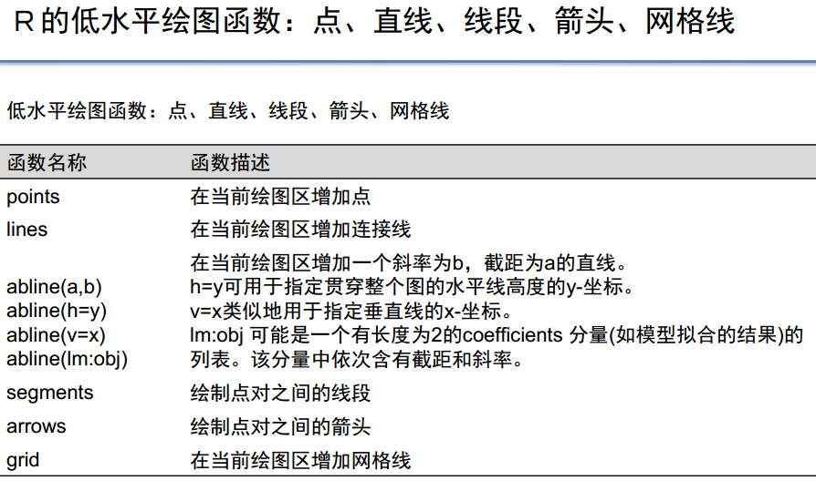
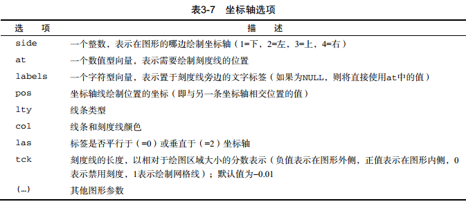

```{r setup, include=FALSE}
knitr::opts_chunk$set(echo = TRUE)

setwd("D:/XH/R_Project/Questionnaire/file/R notebook")
```

# catalogue {.sidebar}
+ 0 低水平绘图函数
    - 参数指定方法
+ 1 线型和符号（点的类型）
+ 2 颜色
+ 3 坐标轴
    - 轴标题
    - 轴刻度及名称
+ 4 图例
+ 5 网格
+ 6 标题
+ 7 文本
    - 数学标注
+ 8 字体
    - 中文字体
+ 9 图画大小
    - 图形尺寸
    - 边界大小
+ 10 图形组合

    
# 0 low level plot
## column 1 
### 低水平绘图函数


### 低水平绘图函数说明


### 指定参数


## Column 2
### examples
#### 基本实现
```{r}
plot(x = c(-4:4),y = c(-4:4),type = 'p', col = 'blue', xlab = 'X', ylab = 'Y')
```

#### 绘制点、连接点
```{r}
plot(x = -4:4,y = -4:4,type = 'p', col = 'blue', xlab = 'X', ylab = 'Y')
points(x = c(3,-2,-1,3,2), y = c(1,2,-2,2,3), col = 'red')
lines(x = c(3,-2,-1,3,2), y = c(1,2,-2,2,3), col = 'black')
```

#### 绘制直线
```{r}
plot(x = -4:4,y = -4:4,type = 'p', col = 'blue', xlab = 'X', ylab = 'Y')
abline(h = 0, col = 'black')
abline(v = 0, col = 'green')
abline(a = 1,b = 1, col = 'yellow')
abline(lm(mtcars$mpg ~ mtcars$qsec), col = 'red')
```

#### 绘制线段
```{r}
plot(x = -4:4,y = -4:4,type = 'p', col = 'blue', xlab = 'X', ylab = 'Y')
segments(x0 = 2, y0 = -4.5, x1 = 4, y1 = -2, col = 'red', lty = 'dotted')
```

#### 绘制箭头、并设置箭头长度、角度、样式
```{r}
plot(x = -4:4,y = -4:4,type = 'p', col = 'blue', xlab = 'X', ylab = 'Y')
arrows(x0 = -4, y0 = 4, x1 = -2, y1 = 0, length = 0.15, angle = 30, code = 3)
```

#### 绘制网格线
```{r}
plot(x = -4:4,y = -4:4,type = 'p', col = 'blue', xlab = 'X', ylab = 'Y')
grid(nx = 3, ny = 5, col = 'lightgray', lty = 'dotted')
```

## Column 3
### examples
#### 多边形和矩形
> + 多边形：polygon()
> + 矩形：rect()

```{r}
plot(x = -4:4,y = -4:4,type = 'p', col = 'blue', xlab = 'X', ylab = 'Y')
polygon(x = c(3,-2,-1,3,2), y = c(1,2,-2,2,3),col = 'red')
# 绘制两个矩形，并填充颜色
rect(xleft = c(-4,0), ybottom = c(2,-4), xright = c(-2,2), ytop = c(4,-2), col = c('blue','yellow'))
```

#### 标题
```{r}
# title():红色标题、蓝色子标题、坐标轴标签为绿及字体大小为0.75
plot(mtcars$wt,mtcars$mpg, main = '',sub = '', xlab = '', ylab = '')
title(main = 'My Title', col.main = 'red', sub = 'My sub-title', col.sub = 'blue', xlab = 'My X label', ylab = 'My Y label', col.lab = 'green', cex.lab = 0.75)
```

#### 任意文本、周边文本
```{r}
# text()、mtext():绘图区域、边缘区域添加文本
plot(mtcars$wt,mtcars$mpg, main = 'Milage vs. Car Weight', xlab = 'Weight', ylab = 'Mileage', pch= 18, col = 'blue')
text(x = mtcars$wt,y = mtcars$mpg, labels = row.names(mtcars), cex = 0.6, pos = 4, col = 'red')
mtext('Added by mtext()', side = 2, line = 2, col = 'blue')
```

#### 坐标轴
```{r}
x <- c(1:10); y <- x ; z <- x/10
par(mar = c(5,4,4,8)+0.1)
plot(x,y, type = 'b', pch = 21, col = 'red', yaxt = 'n', lty = 3, xlab = '', ylab = '')
lines(x,z, type = 'b', pch = 22, col = 'blue', lty = 2)
# 左侧添加坐标轴，并设置刻度标签样式
axis(side = 2, at = x, labels = x, col.axis = 'red', las = 2)
# 右侧添加坐标轴，并设置标签及刻度线长度
axis(side = 4, at = z, labels = round(z, digits = 2), col.axis = 'blue', las = 2, cex.axis = 0.7, tck = -0.1)
mtext('y = 1/x', side = 4, line = 3, cex.lab = 1, las =2, col = 'blue')
title('An Example of Creative Axes', xlab = 'X values', ylab = 'Y = X')
```

#### 图例
```{r}
counts <- table(mtcars$vs, mtcars$gear)
barplot(counts, main = 'Car Distribution by Gears and VS', xlab = 'Number of Gears', col = c('darkblue', 'red'), beside = TRUE)
legend(x = 7.5, y = 12, legend = c('L-A', 'L-B'), pch = 15, col=c('blue', 'red'),cex= 0.8, pt.cex = 1, box.lty = 'dashed')
```

# 1 line/dot type
## Column 1
### line type


### 详细说明
#### 参数说明
> + lty：指定线条类型。lty=1代表实线，2至6都是虚线，虚的程度不一样
> + lwd：指定线条宽度，默认值为lwd=1，可以适当修改1.5倍、2倍等

### examples
#### 简单举例
```{r}

```


## Column 2
### dot type


### 详细说明
#### 参数说明
> + pch：指定绘制点所使用的符号，取值范围[0, 24]，其中4是“差号”，20是“点”
> + cex：指定符号的大小。cex是一个数值，表示pch的倍数，默认是1.5倍

### examples
```{r}

```

# 2 color
## Column 1
### color


### 参数
#### 参数说明
> + col：默认绘图颜色。某些函数(如lines、pie)可以接受一个含有颜色值的向量，并自动循环使用。例如：col=c("red", "blue")需要绘制三条线，那么三条颜色分别为red、blue、red
> + col.axis：坐标轴刻度文字的颜色，不是坐标轴的颜色
> + col.lab：坐标轴标签(名称)的颜色
> + col.main：标题的颜色
> + col.sub：副标题的颜色
> + fg：图形的前景色
> + bg：图形的背景色

### 其它
#### 其它说明
> + 在R中，可以通过颜色下标、颜色名称、十六进制的颜色值、 RGB值或HSV值来指定颜色。
>     - 举例来说， col=1、 col="white"、 col="#FFFFFF"、 col=rgb(1,1,1)和col=hsv(0,0,1)
都是表示白色的等价方式。
>     - 函数rgb()可基于红—绿—蓝三色值生成颜色
>     - hsv()则基于色相—饱和度—亮度值来生成颜色。
> + 函数colors()可以返回所有可用颜色的名称。 
> + R中也有多种用于创建连续型颜色向量的函数，包括rainbow()、 heat.colors()、 terrain.colors()、 topo.colors()以及cm.colors()。
>     - 举例来说， rainbow(10)可以生成10种连续的“彩虹型”颜色。
>     - 多阶灰度色可使用gray()函数生成。这时要通过一个元素值为0和1之间的向量来指定各颜色的灰度。
>     - gray(0:10/10)将生成10阶灰度色。

## column 2
### examples
```{r}

```

# 3 axis
## Column 1
### 刻度标签


### 详细说明
#### 参数说明
> + plot参数
>     - axes=FALSE   将禁用全部坐标轴，框架和刻度全部没有了  
>     - xaxt="n"   禁用x轴的刻度线
>     - yaxt="n"   禁用y轴的刻度线
> + 也可以通过axis函数自定义axis(……)    
>     - side：一个整数。表示在图形的哪边绘制坐标轴（1=下，2=左，3=上，4=右）
>     - at：一个数值向量，表示需要绘制刻度线的位置
>     - labels：一个字符型向量(也可以是数值型)，表示刻度线旁边的文字标签(刻度值)，如果整个不写，则直接使用at的值
>     - col：线条和刻度的颜色
>     - lty：线条类型
>     - las：标签的字体是否平行(=0)或者垂直(=2)坐标轴
>     - tck：刻度线的长度(默认值-0.01，负值表示刻度在图形外，正值表示刻度在图形内侧)

> + 次要刻度线
>     - 需要使用Hmisc包中的minor.tick()函数

### examples
```{r}

```

# 4 legend
## Column 1
### 图例


### 详细说明
#### 参数说明
> + legend(location, title, legend, ……)

### examples
```{r}

```

# 5 grid
## Column 1
### 网格


### 详细说明
#### 参数说明
> + 

### examples
```{r}

```

# 6 title
## Column 1
### 网格


### 详细说明
#### 参数说明
> + 可以使用函数title，格式为：
title(main = " ", sub = " ", xlab = " ",  ylab = " ")
> + 也可以直接把title里面的参数直接放在plot()里面

### examples
```{r}

```


# 7 text
## Column 1
### 文本位置


### 文本大小


### examples
```{r}

```

## column 2
### 数学标注


### 说明
#### 说明
可以使用类似于TeX中的写法为图形添加数学符号和公式。
请参阅help(plotmath)以获得更多细节和示例。
要即时看效果，可以尝试执行demo(plotmath)。部分运行结果如图3-13所示。
函数plotmath()可以为图形主体或边界上的标题、坐标轴名称或文本标注添加数学符号。

### examples
```{r,echo=FALSE, echo=FALSE, message=FALSE}
demo(plotmath)
```


# 8 font
## Column 1
### 字体


### 中文字体


## column 2
### 字体设置
#### 设置说明
> + 字体族的设置却稍显复杂。这是因为衬线、无衬线
和等宽字体的具体映射是与图形设备相关的。
>     - 举例来说，在Windows系统中，等宽字体映射为TT Courier New，衬线字体映射为TT Times New Roman， 无衬线字体则映射为TT Arial（TT代表True Type）。
>     - 如果你对以上映射表示满意，就可以使用类似于family="serif"这样的参数获得想要的结果。
>     - 如果不满意，则需要创建新的映射。在Windows中，可以通过函数windowsFont()来创建这类映射。例如，在执行语句：windowsFonts(A = windowFont('Arial Black'),
B = windowsFont('Bookman Old Style')) 之后，即可使用A、 B作为family的取值。如 par(family="A") 将指定ArialBlack作为绘图字体。

> + 对于PDF格式，可以使用names(pdfFonts())找出你的系统中有哪些字体是可用的，然后使用pdf(file=
"myplot.pdf", family="fontname")来生成图形。
> + 对于以PostScript格式输出的图形，则可以对应地使用names(postscriptFonts())和postscript(file="myplot.ps", family="fontname")。

### examples
```{r}
# 之后创建的所有图形都将拥有斜体、 1.5倍于默认文本大小的坐标轴标签（名称），以及粗斜体、2倍于默认文本大小的标题。
par(font.lab = 3, cex.lab = 1.5, font.main = 4, cex.main = 2)

```


# 9 figure size
## column 1
### 图形尺寸


### examples
```{r}
# 生成一幅4英寸宽、3英寸高、上下边界为1英寸、左边界为0.5英寸、右边界为0.2英寸的图形
par(pin = c(4,3), mai = c(1,.5,1,.2))
```


## column 2
### 边界大小


### examples
```{r}

```


# 10 combinations of several base-graphics
## column 1
### 方法一


### examples
```{r}
# 在par()函数中使用图形参数mfrow=c(nrows, ncols)来创建按行填充的、行数为nrows、列数为ncols的图形矩阵。
# 另外，可以使用nfcol=c(nrows, ncols)按列填充矩阵。

mypar <- par(mfrow = c(2,2))
plot(mtcars$wt, mtcars$mpg, main = 'Scatterplot of wt vs. mpg')
plot(mtcars$wt, mtcars$disp, main = 'Scatterplot of wt vs. disp')
hist(mtcars$wt, main = 'Histogram of wt')
boxplot(mtcars$wt, main = 'Boxplot of wt')
par(mypar)
```

```{r}
# 请注意，高级绘图函数hist()包含了一个默认的标题（使用main=""可以禁用它，抑或使用ann=FALSE来禁用所有标题和标签

mypar <- par(mfrow = c(3,1))
hist(mtcars$wt, main = 'Histogram of wt')
hist(mtcars$mpg, main = 'Histogram of mpg')
hist(mtcars$disp, main = 'Histogram of disp')
par(mypar)
```


## column 2
### 方法二


### 函数layout()
#### 说明
函数layout()的调用形式为layout(mat)，其中的mat是一个矩阵，它指定了所要组合的多个图形的所在位置。
widths = 各列宽度值组成的一个向量
heights = 各行高度值组成的一个向量
相对宽度可以直接通过数值指定，绝对宽度（以厘米为单位）可以通过函数lcm()来指定。

### examples
```{r}
# 一幅图被置于第1行，另两幅图则被置于第2行：
# layout(mat = matrix(c(1,1,2,3), byrow = TRUE), widths = c(3,1), heights = c(1,2))
# layout.show(3)
# hist(mtcars$wt, main = 'Histogram of wt')
# hist(mtcars$mpg[1:3], main = 'Histogram of mpg')
# hist(mtcars$disp, main = 'Histogram of disp')
# par(mar=c(1,1,1,1))
```

```{r}
# 将一幅图形置于第1行，两幅图形置于第2行。
# 但第1行中图形的高度是第2行中图形高度的三分之一。
# 除此之外，右下角图形的宽度是左下角图形宽度的四分之一：

layout(mat = matrix(c(1,1,2,3),2,2, byrow = TRUE), widths = c(3,1), heights = c(1,2))
layout.show(3)
hist(mtcars$wt, main = 'Histogram of wt')
hist(mtcars$mpg, main = 'Histogram of mpg')
hist(mtcars$disp, main = 'Histogram of disp')
par(mar=c(1,1,1,1))
```

## column 3
### 方法三


### examples
```{r}
# 通过排布或叠加若干图形来创建单幅的、有意义的图形，这需要有对图形布局的精细控制能力。你可以使用图形参数fig=完成这个任务。

opar <- par(no.readonly = TRUE)
par(fig = c(0,0.8,0,0.8))
# 散点图
plot(mtcars$wt, mtcars$mpg, xlab = 'Miles Per Gallon', ylab = 'Car Weight')

# 在上方添加箱线图
par(fig = c(0,0.8,0,0.8), new = TRUE)
boxplot(mtcars$wt, horizontal = TRUE, axes = FALSE)
# 在右侧添加箱线图
par(fig = c(0.65,1,0,0.8), new = TRUE)
boxplot(mtcars$mpg, axes = FALSE)

mtext('Enhanced Scatterplot', side = 3, outer = TRUE, line = -3)
par(opar)
```

### 绘图区域


### 绘图区域说明
#### 说明
请试想完整的绘图区域：左下角坐标为(0,0)，而右上角坐标为
(1,1)。图3-19是一幅示意图。参数fig=的取值是一个形如c(x1, x2, y1, y2)的数值向量。

第一个fig=将散点图设定为占据横向范围0~0.8，纵向范围0~0.8。上方的箱线图横向占据0~0.8，纵向0.55~1。右侧的箱线图横向占据0.65~1，纵向0~0.8。 fig=默认会新建一幅图形，所
以在添加一幅图到一幅现有图形上时，请设定参数new=TRUE。

